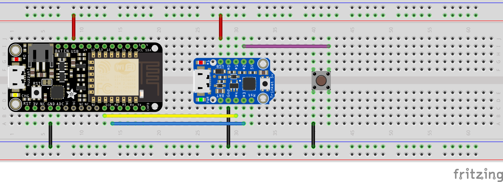
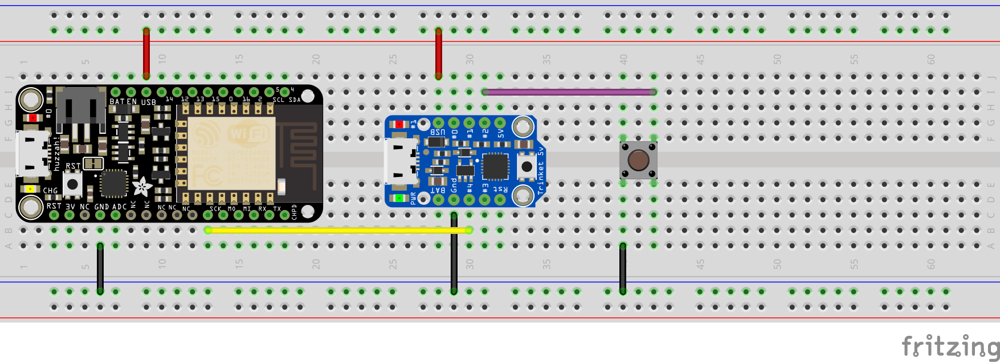

# IOT_Prototyping
An hardware/software solution for prototyping iot projects based on Adafruit's Adafruit Feather HUZZAH ESP8266 and Trinket.
___
### Feather HUZZAH ESP8266
Adafruit's [Adafruit Feather HUZZAH ESP8266](https://learn.adafruit.com/adafruit-feather-huzzah-esp8266?view=all) is a great board for prototyping IOT projects, offering an ESP8266 WiFi module, USB and battery charging, built-in lipoly charger, 9 GPIOs, Serial, SPI and I2C, 2 debug leds, etc... Moreover it can be coded either in Arduino Mode, NodeMCU LUA or MicroPython.  

**[Check Adafruit's guide on Feather HUZZAH ESP8266 for more](https://learn.adafruit.com/adafruit-feather-huzzah-esp8266?view=all)**


Yet its 3.3v logic and only 1 analog input pin with ~1.0V maximum voltage can be troubesome.


### Trinkets to the rescue
Adafruit's [Trinket](https://learn.adafruit.com/introducing-trinket?view=all) is a low cost mini microcontroller board built around Atmel ATtiny85, offering 8K of flash, 5 I/O pins, including 3 analog inputs and 3 PWM outputs, I2C, SPI, 1 debug led and comes in 2 flavours: 3.3v or 5v logic. But Trinket does not have a Serial port connection.

**[Check Adafruit's guide on Trinket for more](https://learn.adafruit.com/introducing-trinket?view=all)**


### Starting communication
There are a lot of ways to communicate data between 2 boards including [Serial](https://learn.sparkfun.com/tutorials/serial-communication),  [SPI](https://learn.sparkfun.com/tutorials/serial-peripheral-interface-spi), [I2C](https://learn.sparkfun.com/tutorials/i2c), [PJON](https://github.com/gioblu/PJON), [IR](https://learn.sparkfun.com/tutorials/ir-communication), ... Each protocol has its strengths and weaknesses, yet the simplest to use (hardware and software sides) to communicate between Feather HUZZAH ESP8266 and Trinket (which can be 3.3v or 5v) is [Serial](https://learn.sparkfun.com/tutorials/serial-communication).

While Trinket doesn't offer Serial pins, we can use [Software Serial](https://www.arduino.cc/en/Reference/SoftwareSerial) to easily communicate in both ways between Trinket and Feather HUZZAH with reasonnable speeds.  
Alternatively, you can use [Frank Zhao's ‘Hardware’ Serial library for the Trinket](https://github.com/frank26080115/Arduino-UsiSerial-Library/).


### Wiring:

```
Trinket            Feather HUZZAH ESP8266
  GND   <-------->   GND
   RX   <-------->   TX
   TX   <-------->   RX

   if you want to power  Trinket from HUZZAH:
   5V   <-------->   BAT/USB depending on your power source
```
RX and TX pins on both Trinket and HUZZAH are the one you choose for SoftwareSerial.  
**Make sure you link RX on Trinket with TX on HUZZAH and TX with RX.**


### Code
Have a look at [code folder](code) for different exemples with mono/bi direction communication.


### Fitting your needs

Trinkets only have 5 I/O pins, SoftwareSerial uses 2 of them. If communication between boards does not need to be bi-directionnal, you can use [Nick Gammon](http://www.gammon.com.au/)'s libraries with your Trinket and use only 1 pin for communication:
- [SendOnlySoftwareSerial](http://gammon.com.au/Arduino/SendOnlySoftwareSerial.zip)
- [ReceiveOnlySoftwareSerial](http://gammon.com.au/Arduino/ReceiveOnlySoftwareSerial.zip)  

Found in the Arduino forum thread [Using only TX of SoftwareSerial, leaving RX pin free](http://forum.arduino.cc/index.php?topic=112013.0).


### AdafruitIO links:
- Adafruit I/O: https://io.adafruit.com/
- Adafruit I/O Guide: https://learn.adafruit.com/adafruit-io
- Adafruit I/O API: https://io.adafruit.com/api/docs/
##### Using adafruitIO with JS
```
var baseUrl = 'https://io.adafruit.com/api/v2',
    endPoint = '/Makio135/feeds/io/data';
var parameters = {
  'x-aio-key': 'fc525f4546aee7be4b8ed5813f7b2051', // your adafruitio key (this one is fake), -> https://io.adafruit.com/{your_username}/settings
  start_time: 0,
  end_time: Date.now(),
  limit: 1000
};

// format parameters for query
var queryParams = [];
for( var i in parameters ){
  queryParams.push( i + '=' + parameters[ i ] );
}
queryParams = queryParams.join( '&' );

// create and send request to AdafruitIO
var oReq = new XMLHttpRequest();
oReq.addEventListener( 'load', function() {
  console.log( this.responseText );
} );
oReq.open( 'GET', baseUrl + endPoint+ '?' + queryParams );
oReq.send();
```

### Connecting services:
- IFTTT: https://ifttt.com/
- IFTTT Adafruit channel:https://ifttt.com/adafruit
- IFTTT Button widget: https://ifttt.com/do_button
- IFTTT Android: https://play.google.com/store/apps/details?id=com.ifttt.ifttt
- IFTTT IOS:https://itunes.apple.com/app/apple-store/id660944635?mt=8
